<h1>Latte Coffee Web </h1> 
<h2>
  Our Link Production: 
  <a href="https://latte-coffee-web.vercel.app/" target="_blank" rel="noopener noreferrer">
    https://latte-coffee-web.vercel.app/
  </a>
</h2>

<h2>Team Member</h2>
<li>Lê Bảo Khanh - 23020001</li>
<li>Nguyễn Tiến Dũng - 23020008</li>

<h2>Overview</h2>
"Latte Coffee" is a modern web app for coffee shops that enables customers to order drinks digitally at their tables. It features a user-friendly interface, customizable beverage options (size, milk, temperature, toppings), and a smart cart for real-time order tracking and adjustments. With a minimalist design, smooth animations, and optimized UX, Latte Coffee offers a seamless and efficient order management solution for contemporary cafés.

<h2>Main Feature</h2>
  <ul>
    <li>Homepage</li>
    <ul>
      <li>Modern and intuitive interface with a warm, coffee-themed design</li>
        <li>Dynamic product categories: Featured, New Arrivals, Promotions, Best Sellers</li>
        <li>Quick access to table selection and menu browsing</li>
        <li>Real-time cart preview and order status</li>
    </ul>
  </ul>
  
<ul>
  <li>Table System</li>
  <ul>
    <li>Digital table management with unique table IDs</li>
        <li>Easy navigation between tables</li>
        <li>Real-time order tracking per table</li>
        <li>Seamless transition between table view and menu</li>
  </ul>
</ul>

<ul>
    <li>Menu Features</li>
        <li>Comprehensive beverage categories: Coffee, Milk Tea, Matcha, Fruit Tea</li>
        <li>Detailed product information including:
            <ul>
                <li>Product images and descriptions</li>
                <li>Price and promotional offers</li>
                <li>Preparation time</li>
                <li>Customer ratings and reviews</li>
            </ul>
        </li>
        <li>Advanced filtering and sorting options:
            <ul>
                <li>By category</li>
                <li>By price range</li>
                <li>By popularity</li>
                <li>By preparation time</li>
            </ul>
        </li>
    </ul>

<ul>
  <li>Product Customization</li>
  <ul>
    <li>Size options (S, M, L)</li>
    <li>Milk type selection (Whole Milk, Almond Milk, Soy Milk, etc.)</li>
    <li>Temperature preference (Hot/Iced)</li>
    <li>Additional toppings and add-ons</li>
    <li>Real-time price calculation based on selections</li>
  </ul>
</ul>

<ul>
  <li>Shopping Cart</li>
  <ul>
    <li>Dynamic cart management</li>
    <li>Real-time price updates</li>
    <li>Quantity adjustment</li>
    <li>Item removal</li>
    <li>Order summary</li>
    <li>Checkout process</li>
  </ul>
</ul>

<ul>
  <li>Order Management</li>
  <ul>
    <li>Order history tracking</li>
    <li>Order status updates</li>
    <li>Easy reordering functionality</li>
    <li>Order modification capabilities</li>
  </ul>
</ul>

<ul>
  <li>User Experience</li>
  <ul>
    <li>Responsive design for all devices</li>
    <li>Smooth animations and transitions</li>
    <li>Intuitive navigation</li>
    <li>Clear product categorization</li>
    <li>Easy-to-use interface</li>
    <li>Real-time updates and notifications</li>
  </ul>
</ul>

<ul>
  <li>Product Detail Page</li>
  <ul>
    <li>Comprehensive product information</li>
    <li>Customization options</li>
    <li>Related product suggestions</li>
    <li>Customer reviews and ratings</li>
    <li>Preparation time and ingredients</li>
    <li>Special offers and discounts</li>
  </ul>
</ul>

<ul>
  <li>Search and Filter</li>
  <ul>
    <li>Advanced search functionality</li>
        <li>Multiple filter options:
            <ul>
                <li>By category</li>
                <li>By price</li>
                <li>By popularity</li>
                <li>By preparation time</li>
            </ul>
        </li>
        <li>Sort options:
            <ul>
                <li>Price (high to low, low to high)</li>
                <li>Popularity</li>
                <li>Newest</li>
                <li>Preparation time</li>
            </ul>
        </li>
  </ul>
</ul>

<ul>
  <li>Basic Functions</li>
  <ul>
    <li>Beautifully designed homepage with categorized products</li>
        <li>Advanced search and filter capabilities</li>
        <li>Shopping cart management</li>
        <li>User account management</li>
        <li>Order history tracking</li>
        <li>Detailed product pages with customization options</li>
        <li>Similar product suggestions</li>
  </ul>
</ul>
## Screenshots

### Basic

User on web

Home
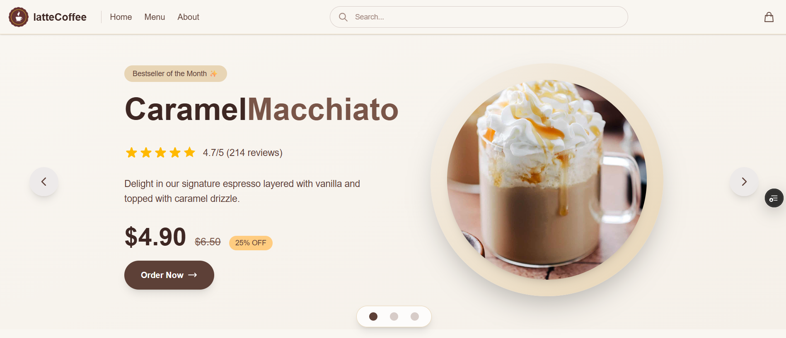

Products in the home page  
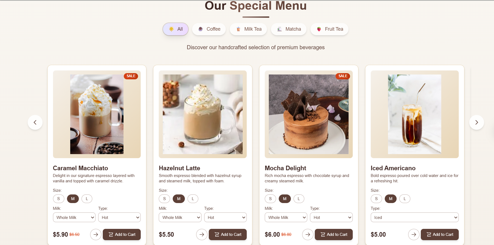

Product details  
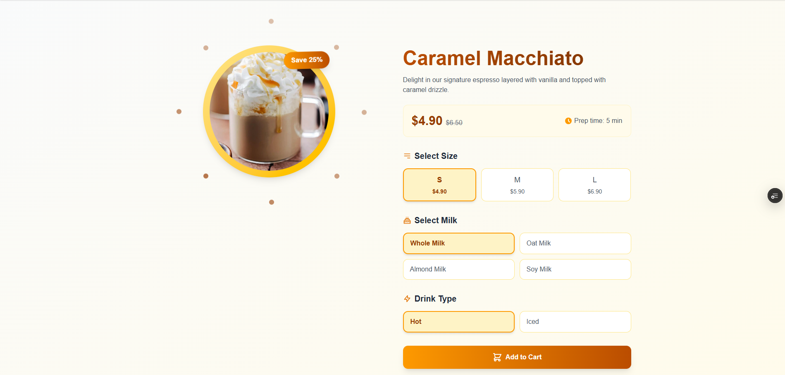

Menu
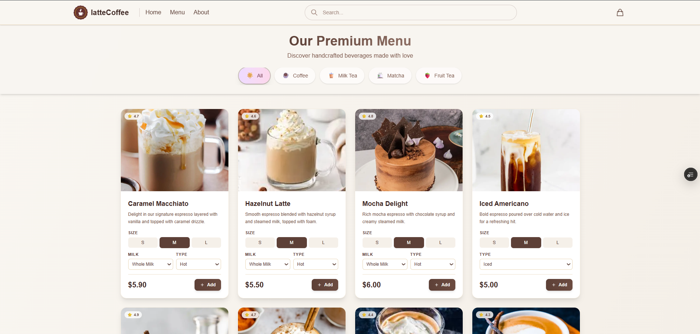

Cart Item
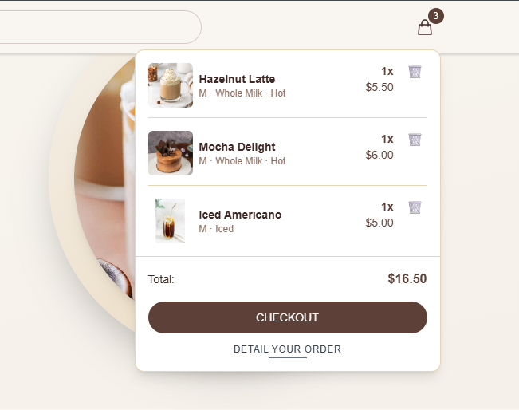

Checkout
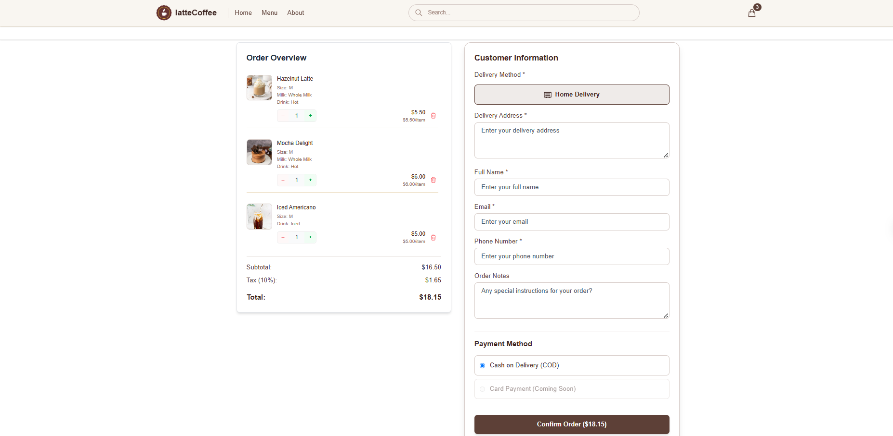

Confirm
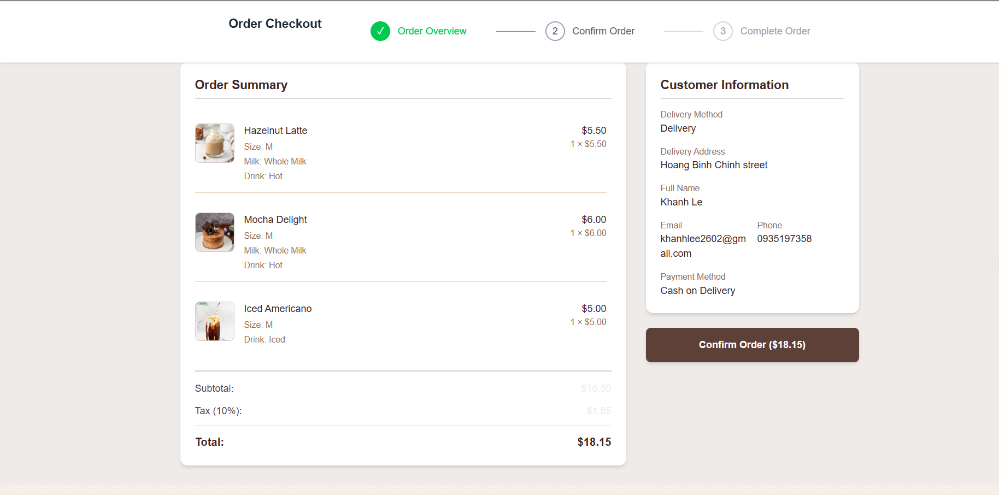

Complete order
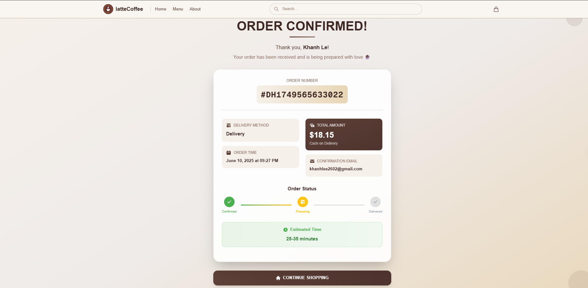

Footer
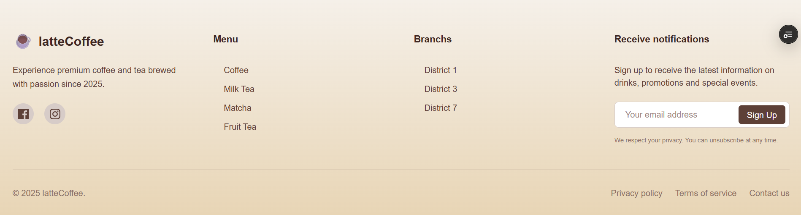

Users on mobile - when they scan QR code
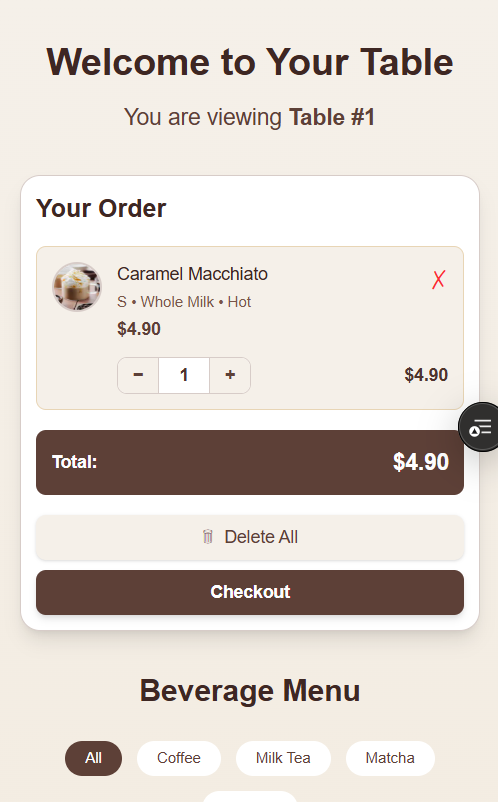

Detail page on mobile
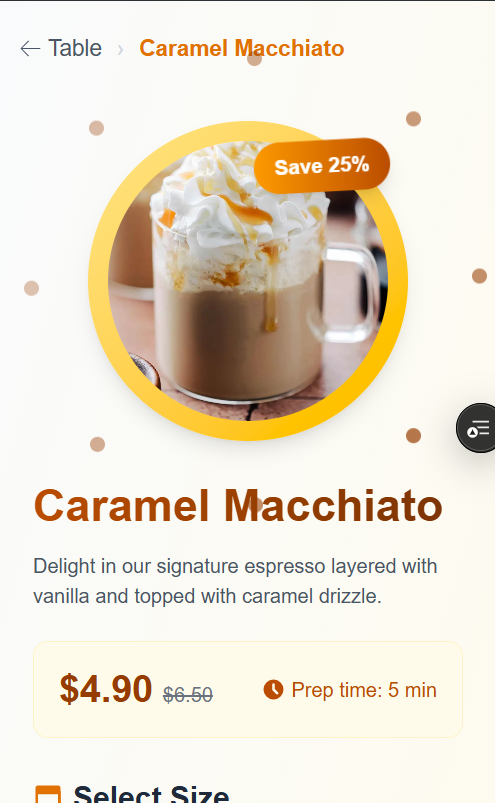

Checkout page on mobile
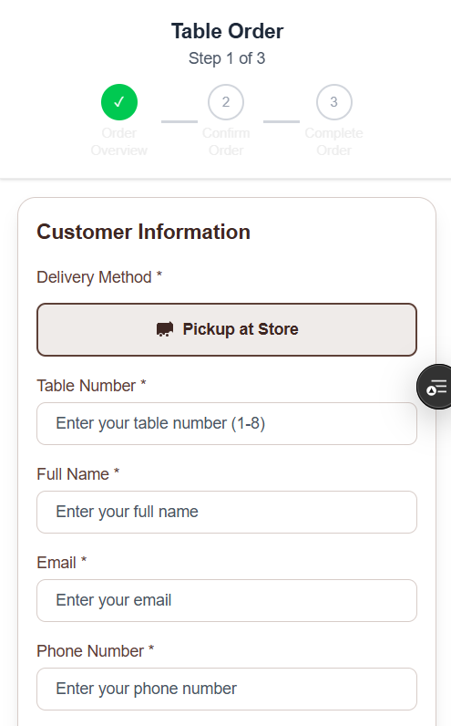

confirm page on mobile
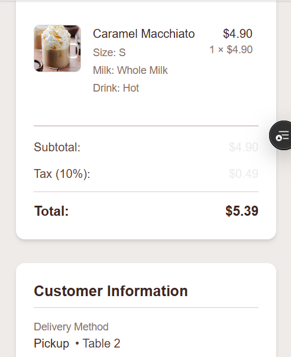

Complete page on mobile
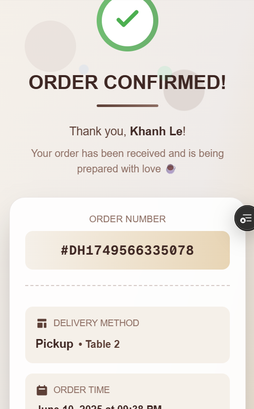
